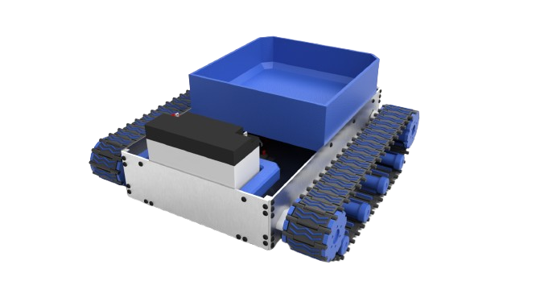
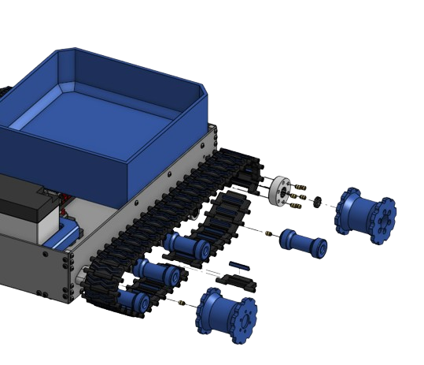
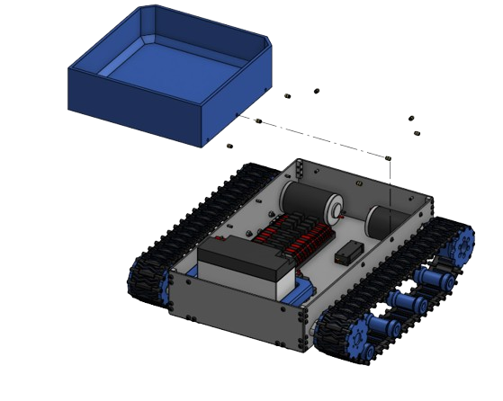
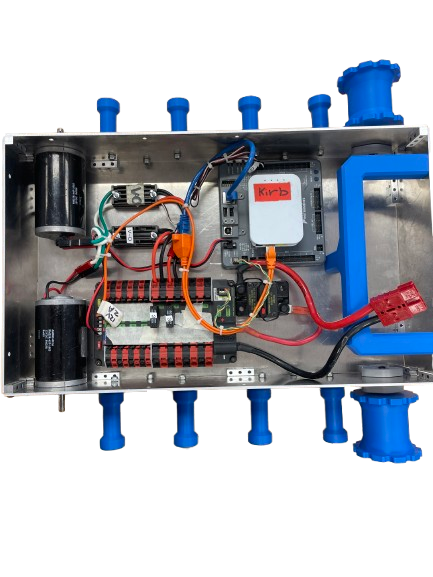
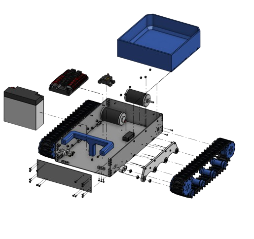

# RoboOx – Firefighter Interior Logistics Robot

  

## Overview

RoboOx is a compact tracked robotics platform designed to support firefighters during interior structural fire operations. The project focuses on solving the logistical challenges firefighters face while transporting critical equipment such as SCBA air cylinders, medical bags, and tools through hazardous low-visibility environments.

Unlike many existing firefighting robots that focus on suppression or reconnaissance, RoboOx was designed as an interior logistics support platform capable of assisting firefighters directly during active operations.

This project was researched, designed, prototyped, and tested by:

* **Alex Meline** – Robotics Systems Engineer
* **Harrison Kurtz** – Robotics Systems Engineer

---

# Project Goals

The RoboOx project was designed around several primary objectives:

* Reduce firefighter fatigue during prolonged incidents
* Improve efficiency of interior fireground logistics
* Transport SCBA cylinders, tools, and emergency supplies
* Navigate confined residential environments
* Operate in low-visibility conditions
* Maintain a compact and durable chassis design
* Support both teleoperated and autonomous operation

---

# Key Features

## Tracked Drivetrain

  

* Dual CIM motor direct-drive system
* Tank steering / skid-steer movement
* Custom 3D printed track system
* Stainless steel dowel pin track assembly
* Designed for traction across debris and uneven terrain

---

## Payload Transport System

  

* Custom 3D printed transport bucket
* Designed for SCBA cylinder transport
* Modular mounting system
* Lightweight and replaceable construction

---

## Electrical & Control System

  

### Hardware

* RoboRIO control system
* Victor SPX PWM motor controllers
* Power Distribution Panel (PDP)
* 12V lead-acid battery
* Power over Ethernet (PoE) radio system

### Software

* Java-based control architecture
* Teleoperated driving mode
* Autonomous support capability
* Wireless Wi-Fi communication

---

# Prototype Specifications

| Specification         | Value                       |
| --------------------- | --------------------------- |
| Drive System          | Dual CIM tracked drivetrain |
| Steering Type         | Tank / skid-steer           |
| Frame Material        | 1/8" 5052-H32 aluminum      |
| Battery Type          | 12V lead-acid               |
| Payload Target        | 200 lbs                     |
| Control System        | RoboRIO                     |
| Programming Language  | Java                        |
| Communication         | Wi-Fi                       |
| Manufacturing Methods | CNC machining + 3D printing |

---

# CAD & Design

  

The RoboOx chassis and drivetrain were designed using CAD software and manufactured through a combination of CNC machining and additive manufacturing.

### Manufacturing Methods

* CNC-cut aluminum chassis plates
* 3D printed drivetrain components
* Heat-set threaded inserts
* Modular mechanical assembly

---

# Testing & Validation

The prototype was tested in several categories:

* Operational endurance
* Maneuverability and navigation
* Structural durability
* Payload transport capacity
* Mechanical wear and reliability

Testing focused on validating the feasibility of a compact firefighter logistics robot platform.

---

# Future Improvements

Potential future development areas include:

* Heat shielding and thermal insulation
* Autonomous mapping and navigation
* Thermal imaging integration
* Sensor fusion systems
* Suspension-based drivetrain
* Improved fireground communication systems
* Higher durability production track materials

---

# Design Documentation

The complete RoboOx engineering portfolio and design documentation includes:

* Problem analysis and market research
* Design criteria and performance requirements
* CAD development and subsystem breakdowns
* Prototype manufacturing processes
* Testing procedures and evaluation
* Final prototype renders and assembly documentation

[📘 View Full Design Portfolio](https://docs.google.com/document/d/1owoSUTfkQ201PdIp94K_mcxk6YMVcUhR7jEPtZckalA/edit?usp=sharing)

---

# CAD Files

CAD files for the RoboOx prototype can be found here:

> [ONSHAPE CAD](https://cad.onshape.com/documents/e00eff3dbcd30c88dda4fca6/w/e59946fafdcda9533040de81/e/c28a8a4c04efc3b3a33b2589?renderMode=0&uiState=6a012feb0b904a812bc520d3)

---

# References

* Textron Systems – Thermite RS1
* Shark Robotics – COLOSSUS
* Shark Robotics – Rhyno Protect
* Boston Dynamics – Spot
* Milrem Robotics – Multiscope Rescue Hydra
* Carnegie Robotics – MultiSense ST25

---

# License

This repository is intended for educational and research purposes.

